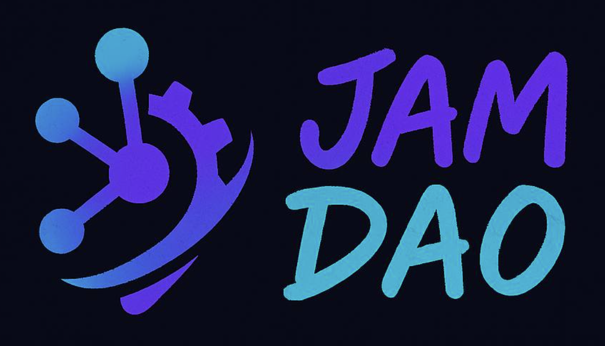

# JAM DAO Governance Bot




A dedicated discussion forum within the JAM DAO Discord server, specifically designed to facilitate thoughtful and constructive conversations around ongoing proposals. This interactive platform empowers members to openly share their insights, perspectives, and opinions on each referendum prior to the submission of an official vote by the designated proxy account on behalf of the JAM DAO.

The primary objective of this forum is to foster an environment of collaboration and informed decision-making, ensuring that every voice within the community is acknowledged and taken into consideration. By harnessing the collective wisdom of your community, you can make well-informed decisions that truly represent the best interests of the entire group.

We encourage everyone to actively participate in these discussions, as your input and feedback are invaluable in shaping the direction and outcomes of the JAM DAO. Together, we can forge a stronger, more unified community that thrives on the principles of transparency, cooperation, and shared vision.

Join the public rooms of the JAM DAO Discord server here: https://discord.gg/cJRQ4KwE


---

## Table of Contents

- [Initial Configuration and Dependencies](#initial-configuration-and-dependencies)
  - [Environment Variables](#environment-variables-envsample)
  - [Install Prerequisite Libraries / Tooling](#install-prerequisite-libraries--tooling)
- [Test Environment](#test-environment)
  - [Components](#components)
  - [Structure](#structure)
  - [Git Hooks](#git-hooks)
    - [Pre-commit Hook](#pre-commit-hook)
    - [Installing Git Hooks](#installing-git-hooks)
  - [Test Environment Usage](#test-environment-usage)
    - [Running Tests](#running-tests)
    - [Creating Your Own Tests](#creating-your-own-tests)
- [Linting](#linting)
- [Production Environment](#production-environment)
  - [Initial Setup](#initial-setup)
  - [Installing PM2 (Process Manager)](#installing-pm2-process-manager)
    - [Daemonizing the Bot to Run 24/7 with PM2](#daemonizing-the-bot-to-run-247-with-pm2)
  - [Running Docker Version](#running-docker-version)
- [Features](#features)
  - [Autonomous Voting](#autonomous-voting)
    - [Vote Settings](#vote-settings)
      - [Kusama Vote Periods](#kusama-vote-periods)
      - [Polkadot Vote Periods](#polkadot-vote-periods)
- [Support](#support)
  - [JAM DAO](#jam-dao)
  - [ChaosDAO](#chaosdao)

---

## Initial Configuration and Dependencies

### Environment Variables [.env.sample](https://raw.githubusercontent.com/JamBrains/opengov-bot/main/.env.sample)

Rename file .env.sample to .env and populate the values, as necessary.

```shell
cp .env.sample .env
```

### Install Prerequisite Libraries / Tooling

```shell
cd opengov-bot

# Install Python (possible macOS commands shown)
brew update && brew install pyenv && brew upgrade pyenv
pyenv local 3.13.4
pyenv use 3.13.4

# Install dependencies
pip3 install -r requirements.txt
```

## Test Environment

This project includes a comprehensive test environment for testing the Discord bot with mock components. This allows you to test the bot's functionality without connecting to Discord's API.

### Components

1. **Mock Discord Objects** - Mock implementations of Discord objects like User, Member, Role, Message, etc.
2. **Mock Task Loop** - A mock implementation of Discord's task loop for testing scheduled tasks
3. **Discord Test Environment** - A test environment class that sets up a mock Discord server with channels, roles, and users
4. **Example Tests** - Unit and integration tests that demonstrate how to use the test environment

### Structure

- **Generic Discord Test Environment** (`bot/test/core/test_env_generic.py`): Contains the base `DiscordTestEnvironment` class with generic Discord mocking functionality.
- **JAM DAO Discord Test Environment** (`bot/test/core/test_env_jam_dao.py`): Contains the `JamDaoDiscordTestEnvironment` class that extends the generic environment with JAM DAO specific setup and helper methods.
- **JAM DAO Configuration** (`bot/test/fixtures/config_jam_dao.py`): Contains centralized configuration data for the JAM DAO Discord server structure (roles, channels, forum tags, etc.).

### Git Hooks

This repository includes Git hooks to help maintain code quality:

#### Pre-commit Hook

The pre-commit hook runs tests before allowing commits to ensure code quality. It:

1. Runs the JAM DAO Discord bot unit tests
2. Ensures that the test environment is working correctly
3. Prevents commits if tests fail

#### Installing Git Hooks

To install the Git hooks, run the provided script:

```bash
./install-hooks.sh
```

This will copy the hooks to your `.git/hooks` directory and make them executable.

If you need to bypass the pre-commit hook in exceptional circumstances, you can use:

```bash
git commit --no-verify -m "Your commit message"
```

### Test Environment Usage

To run the test environment and see your bot in action with mock components:

```bash
python -m bot test-env
```

This will set up a mock Discord environment and run your bot with its scheduled tasks. It will simulate user interactions and print the results.

Additional options for the test environment:

```bash
# Run with debug output
python -m bot test-env --debug

# Specify a test scenario
python -m bot test-env --scenario voting

# Set a custom duration for the test environment
python -m bot test-env --duration 120
```

#### Running Tests

You can run tests using the new CLI interface:

```bash
# Run all tests
python -m bot test --all

# Run only unit tests
python -m bot test --unit

# Run only integration tests
python -m bot test --integration

# Run API-dependent tests
python -m bot test --api

# Run specific test modules
python -m bot test --scheduled-tasks
python -m bot test --ongoing-ref

# Suppress console output during tests
python -m bot test --all --quiet

# Set a custom timeout for tests (default is 60 seconds)
python -m bot test --all --timeout 30
```

You can also use the standard unittest framework directly:

```bash
# Run all tests with unittest
python -m unittest discover bot/test

# Run a specific test file
python -m unittest bot/test/unit/test_scheduled_tasks.py
python -m unittest bot/test/ongoing_ref_call_data.py
```

#### Creating Your Own Tests

You can create your own unit tests in bot/test/unit and integration tests in bot/test/integration using the Discord test environment.

## Linting

This project uses linting tools to maintain code quality and consistency.

### Code Style

The project follows PEP 8 style guidelines for Python code. You can use tools like flake8 or pylint to check your code for style issues.

### Whitespace Linting

A custom whitespace linting tool is included to ensure consistent formatting:

```bash
# Check files for trailing whitespace and missing final newlines without modifying them
python lint_whitespace.py --check

# Fix trailing whitespace and ensure files end with newlines
python lint_whitespace.py

# Show detailed information about each processed file
python lint_whitespace.py --verbose
```

The whitespace linter checks for:
- Trailing whitespace at the end of lines
- Missing newline at the end of files

It processes files with these extensions: `.py`, `.md`, `.txt`, `.json`, `.yml`, `.yaml`, `.sh`, `.html`, `.css`, `.js`, `.ts`, `.jsx`, `.tsx`

Directories like `.git`, `__pycache__`, `venv`, etc. are automatically ignored.

---

## Production Environment

### Setup
- [Discord API key, Server & Forum ID](https://github.com/ChaosDAO-org/InternalGov-2.0/wiki/1.-Initial-Setup#discord-application-api-key)
- [Enabling your Community Server & Creating a Forum Channel](https://github.com/ChaosDAO-org/InternalGov-2.0/wiki/2.-Forum-Channels#what-are-forum-channels)
- [Organising with Categories](https://github.com/ChaosDAO-org/InternalGov-2.0/wiki/3.-Channel-Categories#adding-a-category)
- [FAQ](https://github.com/ChaosDAO-org/InternalGov-2.0/wiki/99.-FAQ)


[](https://www.youtube.com/watch?v=SYnpgcgfDsA)

### Installing PM2 (Process Manager)

> PM2 is a daemon process manager that will help you manage and keep your application/bot online 24/7
https://pm2.keymetrics.io/docs/usage/quick-start/

Install PM2 globally:

```shell
npm install pm2 -g
```

#### Daemonizing the Bot to Run 24/7 with PM2
```shell
# change directory
cd opengov-bot/bot/

# test before daemonizing (review log file in /data/logs/governance_bot.log)
python3 main.py

# daemonize
pm2 start main.py --name polkadot_gov --interpreter python3
pm2 save

# stopping/starting & restarting pm2 process
pm2 stop polkadot_gov
pm2 start polkadot_gov
pm2 restart polkadot_gov

# list process(s); App name, ID, Mode, Status, CPU, Memory, Uptime, Restarts
pm2 list
```

### Running Docker Version

```shell
# Build the image
docker build -t internal-gov-2 .

# Create volume for data
docker volume create internal-gov-2-data

# Run (+ restart) and mount data volume
docker run -d \
  --name internal-gov-2 \
  --mount source=internal-gov-2-data,target=/app/data \
  --restart always \
  internal-gov-2

  docker run -d   --name internal-gov-2   -v ./data:/app/data   -v ./.env:/app/.env   --restart always   internal-gov-2

# Copy .env file
docker cp .env internal-gov-2:/app/
```

---

## Features

### Autonomous Voting


When the bot votes is dictated by `/data/vote_periods`. Each origin of a proposal has its own setting on when the first vote should be made & second. A second vote will only be made if the result differs from the first vote. If the first vote is AYE and it remains AYE on the second period then no vote will be made on the network.
[Polkadot vote periods](/data/vote_periods/polkadot.json)
[Kusama vote periods](/data/vote_periods/kusama.json)


#### Vote Settings
##### Kusama Vote Periods

| Role                | Decision Period (days) | Internal Vote Period (days) | Revote Period (days) |
|---------------------|------------------------|-----------------------------|----------------------|
| Root                | 14                     | 5                           | 10                   |
| WhitelistedCaller   | 14                     | 3                           | 10                   |
| StakingAdmin        | 14                     | 5                           | 10                   |
| Treasurer           | 14                     | 5                           | 10                   |
| LeaseAdmin          | 14                     | 5                           | 10                   |
| FellowshipAdmin     | 14                     | 5                           | 10                   |
| GeneralAdmin        | 14                     | 5                           | 10                   |
| AuctionAdmin        | 14                     | 5                           | 10                   |
| ReferendumCanceller | 7                      | 2                           | 4                    |
| ReferendumKiller    | 14                     | 2                           | 10                   |
| SmallTipper         | 7                      | 1                           | 4                    |
| BigTipper           | 7                      | 1                           | 4                    |
| SmallSpender        | 14                     | 5                           | 10                   |
| MediumSpender       | 14                     | 5                           | 10                   |
| BigSpender          | 14                     | 5                           | 10                   |
| WishForChange       | 14                     | 5                           | 10                   |
> Example:
> > A proposal is submitted with its origin designated as 'Treasurer'. Following a period of five days after its on-chain introduction, a vote is conducted in accordance with the predetermined internal outcome. Should there be a shift in the voting stance from 'AYE' to 'NAY', a subsequent vote will be executed on the tenth day of the proposal's on-chain presence. In instances where the initial decision remains unaltered and the proposal has aged ten days or more, no further on-chain voting action will be undertaken.

---

##### Polkadot Vote Periods
| Role                | Decision Period (days) | Internal Vote Period (days) | Revote Period (days) |
|---------------------|------------------------|-----------------------------|----------------------|
| Root                | 28                     | 7                           | 20                   |
| WhitelistedCaller   | 28                     | 2                           | 20                   |
| StakingAdmin        | 28                     | 7                           | 20                   |
| Treasurer           | 28                     | 7                           | 20                   |
| LeaseAdmin          | 28                     | 7                           | 20                   |
| FellowshipAdmin     | 28                     | 7                           | 20                   |
| GeneralAdmin        | 28                     | 7                           | 20                   |
| AuctionAdmin        | 28                     | 7                           | 20                   |
| ReferendumCanceller | 7                      | 2                           | 4                    |
| ReferendumKiller    | 28                     | 4                           | 20                   |
| SmallTipper         | 7                      | 2                           | 4                    |
| BigTipper           | 7                      | 2                           | 4                    |
| SmallSpender        | 28                     | 7                           | 20                   |
| MediumSpender       | 28                     | 7                           | 20                   |
| BigSpender          | 28                     | 7                           | 20                   |
| WishForChange       | 28                     | 7                           | 20                   |
> Example:
> > A proposal is submitted with its origin designated as 'AuctionAdmin'. Following a period of seven days after its on-chain introduction, a vote is conducted in accordance with the predetermined internal outcome. Should there be a shift in the voting stance from 'AYE' to 'NAY', a subsequent vote will be executed on the twentieth day of the proposal's on-chain presence. In instances where the initial decision remains unaltered and the proposal has aged ten days or more, no further on-chain voting action will be undertaken.

---

## Support
For assistance or inquiries, please refer to the following official channels of communication:

### JAM DAO

| Platform | UID/URL |
|----------|------------------------------------------------------|
| Discord  | [](https://discord.gg/cJRQ4KwE) |


### ChaosDAO

| Platform | User   | UID/URL                                                                                                                                                                                      |
|----------|--------|----------------------------------------------------------------------------------------------------------------------------------------------------------------------------------------------|
| Telegram | n4droj | [](https://t.me/n4droj)                                  |
| Discord  | n4dro  | [](https://discord.com/invite/fGJe2AWkGe) |
| Twitter  | n4dro  | [](https://www.x.com/N4DRO)                                                                                                           |
